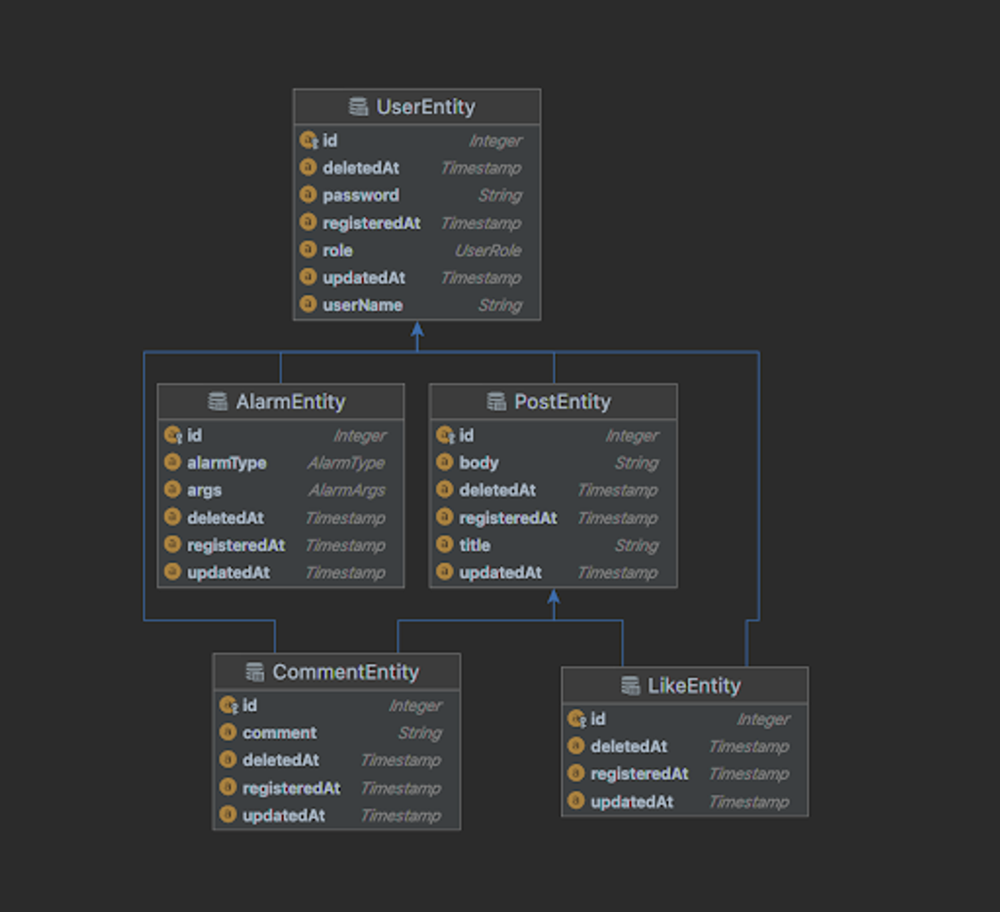

## 📍 API Documentation

---

- [Swagger](http://ec2-43-201-22-119.ap-northeast-2.compute.amazonaws.com:8080/swagger-ui/index.html#/)

# **멋사스네스(MutsaSNS)**
### 📑 요구사항 명세서

---

#### 1️⃣ **회원 인증·인가**

- 모든 회원은 회원가입을 통해 회원이 됩니다.
- 로그인을 하지 않으면 SNS 기능 중 피드를 보는 기능만 가능합니다.
- 로그인한 회원은 글쓰기, 수정, 댓글, 좋아요, 알림 기능이 가능합니다.

#### 2️⃣ 글쓰기

- 포스트를 쓰려면 회원가입 후 로그인(Token받기)을 해야 합니다.
- 포스트의 길이는 총 300자 이상을 넘을 수 없습니다.
- 포스트의 한 페이지는 20개씩 보이고 총 몇 개의 페이지인지 표시가 됩니다.
- 로그인 하지 않아도 글 목록을 조회 할 수 있습니다.
- 수정 기능은 글을 쓴 회원만이 권한을 가집니다.
- 포스트의 삭제 기능은 글을 쓴 회원만이 권한을 가집니다.

#### 3️⃣ 피드

- 로그인 한 회원은 자신이 작성한 글 목록을 볼 수 있습니다.

#### 4️⃣ 댓글

- 댓글은 회원만이 권한을 가집니다.
- 글의 길이는 총 100자 이상을 넘을 수 없습니다.
- 회원은 다수의 댓글을 달 수 있습니다.

#### 5️⃣ 좋아요

- 좋아요는 회원만 권한을 가집니다.
- 좋아요 기능은 취소가 가능합니다.

#### 6️⃣ 알림

- 알림은 회원이 자신이 쓴 글에 대해 다른회원의 댓글을 올리거나 좋아요시 받는 기능입니다.
- 알림 목록에서 자신이 쓴 글에 달린 댓글과 좋아요를 확인할 수 있습니다.

 
 

### 📑 REST API 설계

---
#### 기본 url
/api/v1/  

#### 회원 인증, 인가
- 회원가입: POST /join  
- 로그인: POST /login  

#### 포스트
- 포스트 리스트: GET /posts  
- 포스트 상세조회: GET /posts/{postId}  
- 포스트 등록: POST /posts  
- 포스트 수정: PUT /posts/{id}  
- 포스트 삭제: DELETE /posts/{id}  

 
 

### 📑 ER Diagram

---

 
 

### 📑프로젝트 진행 타임라인  

---

아래 체크리스트는 종합 프로젝트 중 개인 프로젝트 첫번째 미션의 필수 요구사항입니다.

#### 1일차: 환경 구축 및 프로젝트 빌드, CI/CD 파이프라인 구축   
1. AWS EC2와 Docker 환경에서 프로젝트 빌드하기  
2. HelloController 작성하기  
3. Gitlab, Linux Crontab 사용하여 CI/CD 파이프라인 구축하기  
﹅ 참고 : [1일차 힌트](https://likelion.notion.site/1-784b572ab0fc48aba16dd26cf538ba5d) 

#### 2일차   
1. join, login 기능을 구현한 UserController 작성하기   
2. join 성공, 실패 케이스를 검증하기 위한 Controller 테스트 코드 작성하기  
3. Login 성공, 실패 케이스를 검증하기 위한 Service 테스트 코드 작성하기  
﹅ 참고 : [2일차 힌트](https://likelion.notion.site/2-8159feafe51c490aa34f5f10a506d9ee)

#### 3일차  
1. Post 작성 기능을 구현한 PostController 작성하기  
2. Post 작성 성공, 실패 케이스 검증을 위한 PostControllerTest 작성  
3. Pojo로 Post 작성 성공, 실패 케이스 검증을 위한 PostServiceTest 작성  
﹅ 참고 : [3일차 힌트](https://likelion.notion.site/3-83be4e0e53754cffbe642ee16b3f8154)

#### 4일차  
1. PostController에 Post 조회, 수정 기능 구현   
2. Post 조회 성공, 수정 성공/실패 케이스 검증을 위한 PostControllerTest 작성  
3. Post 조회 성공, 수정 실패 케이스 검증을 위한 PostServiceTest 작성  
﹅ 참고 : [4일차 힌트](https://likelion.notion.site/4-843d92e9ec9d4c26909f164abf42f2a2)

#### 5일차  
1. PostController에 Post 삭제, 전체 목록 조회 기능 구현  
2. Post 삭제 성공/실패, 목록 조회 성공 케이스 검증을 위한 PostControllerTest 작성  
3. Post 삭제 실패 케이스 검증을 위한 PostServiceTest 작성  
﹅ 참고 : [5일차 힌트](https://likelion.notion.site/5-4f9a85c676d94f9598de9fed4ac6dc8c)

 
 

### 📑 1주차 미션 요약

---

[접근 방법]
* 기능별 Request, Response 클래스를 선언하였다.  
* 선언한 Request, Response 클래스를 컨트롤러에서 DTO를 통해 필요한 데이터를 교환한다.  

[특이사항]
1. 아쉬웠던 점  
   * 컨디션 조절 실패, 모르는 내용을 공부하면서 개발을 진행하다 보니, 프로젝트에 많은 시간을 할애하지 못했다.
   * 테스트 주도 개발(TDD)이 미흡하게 진행되었다.
   * Fixture 
   * dto가 매우 많다

2. 궁금했던 점  
   * dto가 많은데, 조금 더 추상화를 할 수 있는 방법이 궁금하다.